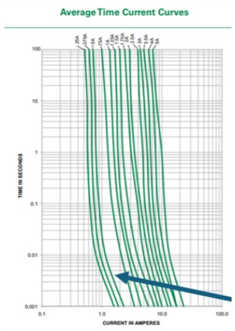
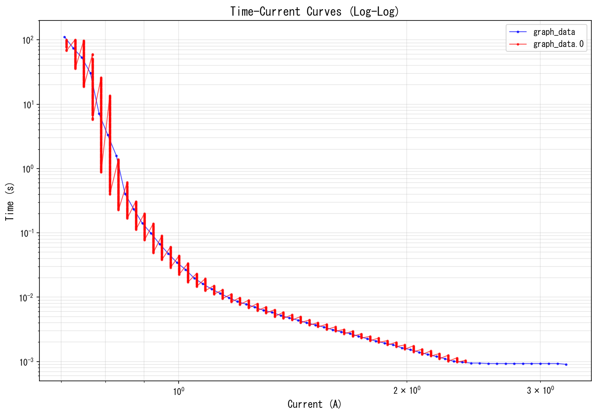
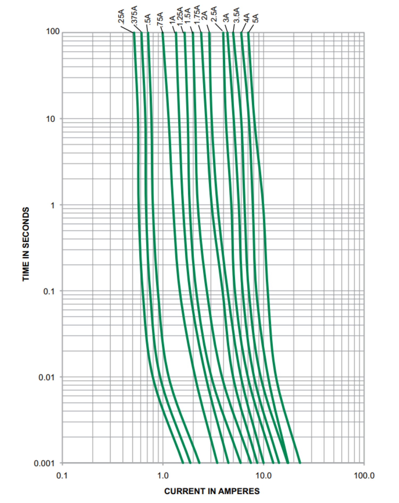
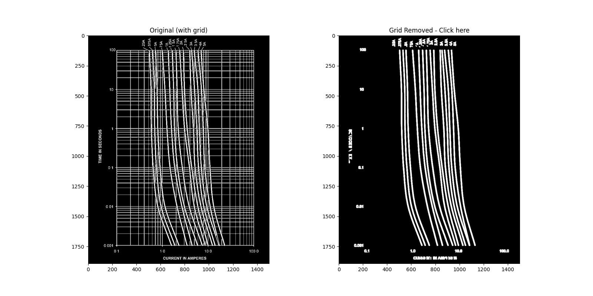
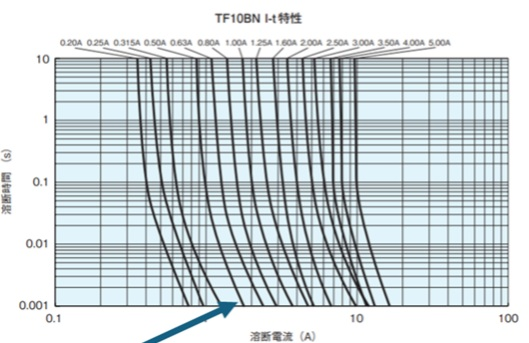
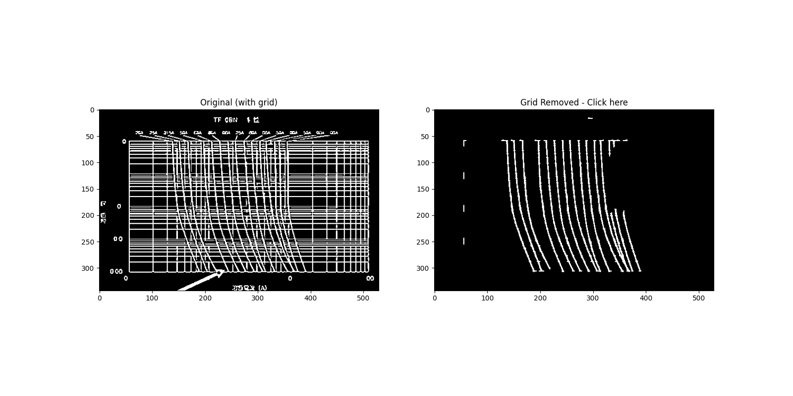
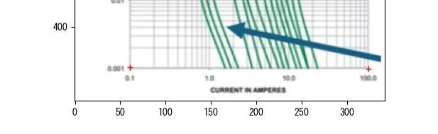
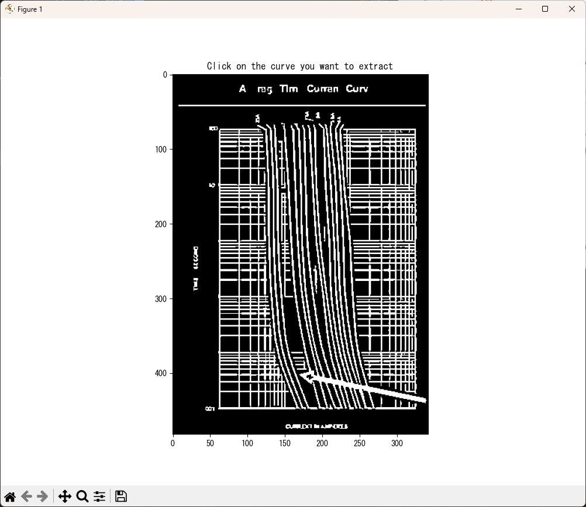
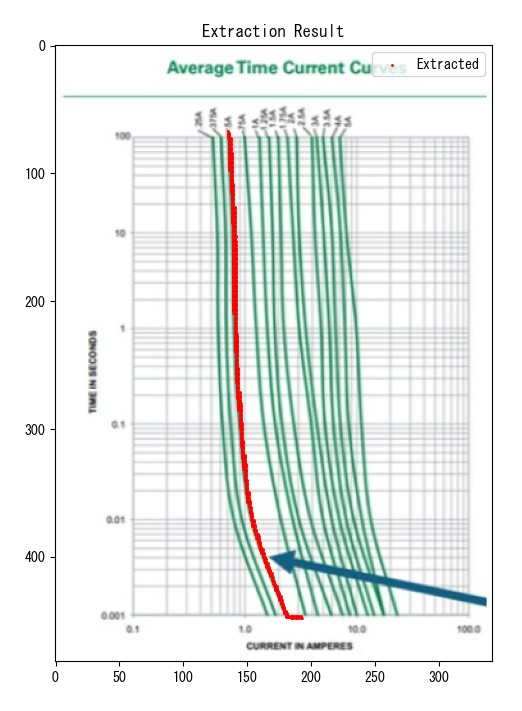

# LineTraceGraph

対数グラフから曲線データを抽出してCSVファイルに変換するPythonツールです。

このツールは、データシートやレポートに含まれる対数グラフ（例: I-t 特性曲線）の画像から、特定の曲線を選択してデジタルデータ（CSV形式）に変換します。

## 実例

### 入力画像の例



データシートに含まれるI-t特性曲線（時間-電流特性）の対数グラフです。このような画像から曲線データを抽出します。

### 処理結果

抽出されたデータは`graph_data.csv`として保存され、Pythonやエクセルで再利用できます。



複数の曲線を重ねて表示し、データの整合性を確認できます。`plot_csv.py`を使って、抽出結果を視覚的に検証可能です。

## 特徴

- 対数スケールのX軸・Y軸に対応
- 線形スケールにも対応可能
- **[v2.0新機能]** 適応的二値化による高精度抽出
- **[v2.0新機能]** エッジ検出との併用で線境界を正確に捉える
- **[v2.0新機能]** X座標重複の自動削除（垂直線ノイズ除去）
- **[v2.0新機能]** モルフォロジー処理による細線化
- **[v2.1新機能]** コマンドライン引数によるスケール指定
- **[v2.2新機能]** 色付き曲線と黒い曲線の自動判別
- **[v2.2新機能]** グリッド線自動除去（黒線グラフ対応）
- グリッド線の自動除去
- インタラクティブな曲線選択
- CSV形式でのデータ出力

## v2.2 の技術的改善（グリッド線と曲線の分離）

### 対応グラフタイプ

v2.2では、以下の2種類のグラフに自動対応します：

| グラフタイプ | 曲線の色 | 検出モード | 処理方法 |
|-------------|---------|-----------|---------|
| カラー曲線グラフ | 緑、青、赤など | 色検出モード | HSV色空間で彩度の高いピクセルを抽出 |
| モノクロ曲線グラフ | 黒 | 黒線検出モード | グリッド線除去後に曲線を抽出 |

### 色検出モード

```python
# HSV色空間で彩度が高いピクセル（色付き曲線）を検出
saturation_threshold = 40
colored_mask = cv2.threshold(s, saturation_threshold, 255, cv2.THRESH_BINARY)[1]
```

- 彩度（Saturation）が高いピクセルを抽出
- グリッド線（灰色=低彩度）は自動的に除外
- 緑、青、赤、紫、オレンジなど様々な色に対応

### 黒線検出モード（グリッド線除去）

```python
# 水平・垂直の長い連続線をグリッドとして検出
h_kernel = cv2.getStructuringElement(cv2.MORPH_RECT, (60, 1))
v_kernel = cv2.getStructuringElement(cv2.MORPH_RECT, (1, 60))
h_lines = cv2.morphologyEx(dark_thresh, cv2.MORPH_OPEN, h_kernel)
v_lines = cv2.morphologyEx(dark_thresh, cv2.MORPH_OPEN, v_kernel)
```

- モルフォロジー演算で水平/垂直の長い線を検出
- 検出したグリッド線を除去し、斜め方向の曲線のみを保持
- 形状フィルタリングで残ったグリッド断片も除去

### 自動モード切替

```python
if colored_pixels > 50000:
    # 色検出モード: 彩度の高いピクセルをそのまま使用
    result = colored_mask
else:
    # 黒線検出モード: グリッド線を除去して曲線を抽出
    result = cv2.bitwise_and(dark_thresh, cv2.bitwise_not(grid_lines))
```

### 処理結果の例

#### カラー曲線グラフ（graph1.png）

**入力画像:**



**グリッド除去結果:**



緑色の曲線がグリッド線なしで抽出されています。

#### モノクロ曲線グラフ（graph2.jpg）

**入力画像:**



**グリッド除去結果:**



黒い曲線とグリッド線が同色でも、形状の違いで分離できています。

## v2.0 の技術的改善

### 適応的二値化

```python
cv2.adaptiveThreshold(self.gray_img, 255, cv2.ADAPTIVE_THRESH_GAUSSIAN_C,
                      cv2.THRESH_BINARY_INV, 11, 2)
```

- 局所的な明るさに適応した閾値処理
- 薄いグリッド線や背景ノイズを効果的に除去
- 照明ムラのある画像でも安定して動作

### エッジ検出

```python
cv2.Canny(self.gray_img, 50, 150)
```

- エッジ検出で線の境界を正確に捉える
- 細い線や低コントラスト部分も確実に抽出
- 適応的二値化と組み合わせることで精度向上

### X座標重複の自動削除

```python
# 各X座標に対してY座標をグループ化
x_to_ys = defaultdict(list)
for px, py in self.extracted_pixels:
    x_to_ys[px].append(py)

# 中央値を採用
for px in sorted(x_to_ys.keys()):
    py_median = np.median(x_to_ys[px])
    unique_points.append((px, py_median))
```

- 同一X座標に複数Y値がある場合、中央値を採用
- 垂直線状のノイズを排除し、滑らかな曲線を生成
- データ点数を大幅削減（例: 955点 → 59点）しつつ精度向上

### モルフォロジー処理

```python
# 細線化（侵食処理）
kernel_thin = np.ones((2, 2), np.uint8)
thinned = cv2.erode(cleaned, kernel_thin, iterations=1)
```

- 細線化により線の中心を正確に取得
- 小さなノイズ成分を面積フィルタで除去（min_area = 30）
- 太い線から真の中心線を抽出

## インストール

```bash
pip install opencv-python numpy matplotlib pandas scipy
```

または

```bash
pip install -r requirements.txt
```

### 動作環境

- Python 3.7 以上
- Windows / macOS / Linux

## 使用方法

### コマンドライン引数

```bash
python LineTracerPrototype.py <画像ファイル> [オプション]
```

#### 引数一覧

| 引数 | 短縮形 | 説明 | デフォルト |
|------|--------|------|------------|
| `image` | - | 入力画像ファイルのパス（必須） | - |
| `--output` | `-o` | 出力CSVファイル名 | `graph_data.csv` |
| `--x-scale` | - | X軸のスケール（`log` または `linear`） | `log` |
| `--y-scale` | - | Y軸のスケール（`log` または `linear`） | `log` |
| `--smooth` | - | 移動平均のウィンドウサイズ（0で無効） | `0` |

#### ヘルプの表示

```bash
python LineTracerPrototype.py --help
```

### 使用例

#### 基本的な使い方（log-log グラフ）

```bash
python LineTracerPrototype.py graph1.jpg
```

デフォルトでX軸・Y軸ともに対数スケールとして処理されます。

#### 出力ファイル名を指定

```bash
python LineTracerPrototype.py graph1.jpg -o my_data.csv
```

#### 線形-線形グラフ

```bash
python LineTracerPrototype.py graph1.jpg --x-scale linear --y-scale linear
```

#### 対数-線形グラフ（X軸がlog、Y軸がlinear）

```bash
python LineTracerPrototype.py graph1.jpg --x-scale log --y-scale linear
```

#### 線形-対数グラフ（X軸がlinear、Y軸がlog）

```bash
python LineTracerPrototype.py graph1.jpg --x-scale linear --y-scale log
```

#### スムージングを適用

```bash
python LineTracerPrototype.py graph1.jpg --smooth 5
```

#### 全オプションを組み合わせ

```bash
python LineTracerPrototype.py graph1.jpg -o result.csv --x-scale log --y-scale linear --smooth 3
```

### スケールの組み合わせ

| X軸 | Y軸 | オプション | 用途例 |
|-----|-----|------------|--------|
| log | log | （デフォルト） | I-t特性曲線、周波数特性 |
| linear | linear | `--x-scale linear --y-scale linear` | 一般的なXYグラフ |
| log | linear | `--x-scale log --y-scale linear` | 片対数グラフ（X軸log） |
| linear | log | `--x-scale linear --y-scale log` | 片対数グラフ（Y軸log） |

### インタラクティブ操作

#### ステップ 1: 軸のキャリブレーション

プログラムを実行すると、画像が表示されます。以下の順番で4点をクリックしてください:

1. X軸の最小値（左端）
2. X軸の最大値（右端）
3. Y軸の最小値（下端）
4. Y軸の最大値（上端）



クリック後、コンソールで各点の実際の数値を入力します:

```
クリックした点に対応する数値を入力してください
※ 対数グラフの場合、実際の値を入力してください
   例: 0.1, 1, 10, 100 など（10^-1 ではなく 0.1 と入力）
点1 (X min) の数値 [例: 0.1]: 0.1
点2 (X max) の数値 [例: 100]: 100
点3 (Y min) の数値 [例: 0.001]: 0.01
点4 (Y max) の数値 [例: 1000]: 100
```

> **重要**: 対数グラフの場合、`10^-1` ではなく `0.1` のように実際の数値を入力してください。

#### ステップ 2: 曲線の選択

処理された画像が表示されます。抽出したい曲線の上を1回クリックしてください。



- クリックすると自動的にウィンドウが閉じます
- コンソールに抽出状況が表示されます
- 抽出されたピクセル数や連結成分の数が確認できます

#### ステップ 3: 結果の確認

抽出された曲線が赤色で表示されます。



- 画像を確認したら、×ボタンでウィンドウを閉じてください
- 自動的にCSVファイルが生成されます
- コンソールに結果の統計が表示されます:

```
CSVファイルを出力しました: graph_data.csv
スケール: X軸=log, Y軸=log
データ点数: 59 (重複X削減後)
元のピクセル数: 955
```

## 出力形式

CSVファイルは以下の形式で出力されます:

```csv
Current(A),Time(s)
0.7069379532271137,111.63062564939905
0.7257584258084107,74.62734870595385
0.7450799468714964,53.078434393405935
...
```

- 1列目: X軸の値（例: 電流）
- 2列目: Y軸の値（例: 時間）
- 対数グラフの場合、値は自動的に対数変換されて実際の物理量として出力されます
- **[v2.0]** X座標が重複しないユニークなデータセット

## プロットツール（v2.0新規）

### 単一ファイルの表示

```bash
python plot_csv.py graph_data.csv
```

対数-対数グラフとして表示され、以下の情報が含まれます:

- データ点数
- Current範囲
- Time範囲

### 複数ファイルの比較

改善前後の比較などに便利:

```bash
python plot_csv.py graph_data.csv graph_data_old.csv
```

両方のデータを重ねて表示し、改善効果を視覚的に確認できます。

## v1.0 vs v2.0 の比較

### v1.0（改善前）

- データ点数: 955点
- 同一X座標に複数Y値が存在（10-20個以上）
- 垂直線状のノイズを含む
- 太い線の影響でデータが不正確

### v2.0（改善後）

- データ点数: 59点（X座標ユニーク）
- 各X座標に1つのY値のみ（中央値採用）
- 滑らかで正確な曲線
- 線の真の中心を抽出

> **注意**: データ点数が大幅に減少していますが、これは重複除去による精度向上の結果です。

## トラブルシューティング

### 問題1: 複数の曲線が一緒に選択される

**原因**: 線同士が近すぎて連結成分として認識されている

**対策**:

- より高解像度の画像を使用する
- グリッド線が薄い画像を使用する
- パラメータを調整する（下記参照）

### 問題2: 線が途切れる

**原因**: 画像処理が強すぎる

**対策**: `_thin_lines()` メソッドのパラメータを調整

```python
def _thin_lines(self):
    # Cannyエッジ検出の閾値を調整（50, 150）
    edges = cv2.Canny(self.gray_img, 30, 120)  # より低感度に

    # 最小面積を調整（30）
    min_area = 20  # より小さな成分も保持
```

### 問題3: グリッド線が残る

**原因**: 適応的二値化のパラメータが不適切

**対策**: パラメータを調整

```python
# ブロックサイズや定数Cを調整
binary_adaptive = cv2.adaptiveThreshold(
    self.gray_img, 255, cv2.ADAPTIVE_THRESH_GAUSSIAN_C,
    cv2.THRESH_BINARY_INV, 15, 3  # 11, 2 から変更
)
```

### [v2.0推奨設定]

- 高解像度画像を使用: 1500×1500ピクセル以上
- スムージングを適用: `--smooth 3`
- 面積フィルタを調整: `min_area = 50  # より大きくしてノイズ除去を強化`

## パラメータ調整ガイド

より良い結果を得るために調整できるパラメータ:

### 適応的閾値のパラメータ

```python
# _thin_lines() メソッド内
binary_adaptive = cv2.adaptiveThreshold(
    self.gray_img, 255, cv2.ADAPTIVE_THRESH_GAUSSIAN_C,
    cv2.THRESH_BINARY_INV,
    11,  # ブロックサイズ（奇数、9-15推奨）
    2    # 定数C（1-5推奨）
)
```

### エッジ検出のパラメータ

```python
# _thin_lines() メソッド内
edges = cv2.Canny(
    self.gray_img,
    50,   # 低閾値（30-70推奨）
    150   # 高閾値（100-200推奨）
)
```

### 面積フィルタ

```python
# _thin_lines() メソッド内
min_area = 30  # 20-100 の範囲で調整
```

- 値を大きくすると: 小さなノイズが除去されるが、細い線も消える
- 値を小さくすると: 細い線も残るが、ノイズも残る

## 画像の準備

### 推奨される画像

良好な結果を得るための画像条件:

- 高解像度（1000×1000ピクセル以上、v2.0では1500×1500推奨）
- 抽出したい線が濃い黒色
- グリッド線が薄いグレー色
- 背景が白色
- PNG、JPG、TIFF形式

### 避けるべき画像

- 低解像度の画像
- 線とグリッドの色が似ている
- 背景が黄ばんでいる
- 圧縮率が高すぎるJPG

## 応用例

### 複数の曲線を抽出

```bash
# 1本目
python LineTracerPrototype.py graph1.jpg -o curve1.csv

# 2本目（同じ画像から別の曲線を選択）
python LineTracerPrototype.py graph1.jpg -o curve2.csv
```

### Pythonスクリプトから直接利用

```python
from LineTracerPrototype import GraphDigitizer

digitizer = GraphDigitizer("graph1.jpg")
digitizer.calibrate_axis()
digitizer.select_and_trace_curve()

# log-log（デフォルト）
digitizer.export_csv("data_loglog.csv", x_is_log=True, y_is_log=True)

# linear-linear
digitizer.export_csv("data_linlin.csv", x_is_log=False, y_is_log=False)

# log-linear
digitizer.export_csv("data_loglin.csv", x_is_log=True, y_is_log=False)
```

## ファイル構成

```
LineTraceGraph/
├── LineTracerPrototype.py          # メインプログラム
├── plot_csv.py                     # [v2.0新規] グラフ描画ツール
├── graph_data.csv                  # 出力CSV
├── graph1.jpg                      # 入力画像例
├── requirements.txt                # 依存パッケージ
├── LICENSE                         # ライセンスファイル
├── README.md                       # このファイル
└── LineTracerPrototype_README_v2.0.md  # v2.0詳細ドキュメント
```

## 技術的な詳細

### 座標変換の数式

#### 対数スケールの場合

ピクセル座標から物理値への変換式:

```
log(V) = ratio * (log(V_max) - log(V_min)) + log(V_min)

ratio = (pixel - pixel_min) / (pixel_max - pixel_min)

V = 10^log(V)
```

#### 線形スケールの場合

```
V = ratio * (V_max - V_min) + V_min

ratio = (pixel - pixel_min) / (pixel_max - pixel_min)
```

### X座標重複削除アルゴリズム

```python
from collections import defaultdict

# ステップ1: X座標ごとにY座標をグループ化
x_to_ys = defaultdict(list)
for px, py in extracted_pixels:
    x_to_ys[px].append(py)

# ステップ2: 各X座標の中央値を計算
unique_points = []
for px in sorted(x_to_ys.keys()):
    py_median = np.median(x_to_ys[px])
    unique_points.append((px, py_median))

# 結果: 各X座標に1つのY値のみ
```

メリット:

- 垂直線状のノイズ除去
- 太い線の中心を正確に取得
- データサイズの削減
- 曲線の滑らかさ向上

## ライセンス

このプロジェクトは MIT License の下で公開されています。詳細は [LICENSE](LICENSE) ファイルをご覧ください。

## 作者

keides2

## 更新履歴

### v2.1

新機能:

- ✨ コマンドライン引数によるスケール指定（`--x-scale`, `--y-scale`）
- ✨ 出力ファイル名の指定（`-o`, `--output`）
- ✨ スムージングオプションのコマンドライン対応（`--smooth`）
- ✨ ヘルプ表示機能（`--help`）

改善点:

- 🔧 `export_csv()` に `x_is_log`, `y_is_log` パラメータを追加
- 🔧 出力時にスケール情報を表示

### v2.0

新機能:

- ✨ 適応的二値化とエッジ検出を導入
- ✨ X座標重複の自動削除機能（955点→59点の最適化例）
- ✨ モルフォロジー細線化処理
- ✨ 移動平均スムージングオプション
- ✨ データ点数統計表示機能
- ✨ 比較プロットツール（plot_csv.py）追加

改善点:

- 🔧 線抽出精度の大幅向上
- 🔧 ノイズ除去アルゴリズムの最適化
- 🔧 CSV出力形式の改善（空行削除）
- 🔧 エラーハンドリングの強化

技術的改善:

- 適応的閾値処理による局所明度対応
- Cannyエッジ検出との併用
- 中央値ベースの重複削除
- 面積フィルタによる小ノイズ除去

### v1.0

- 基本的な対話型抽出機能
- 対数軸キャリブレーション
- CSV出力機能
- グリッド線除去機能
- 連結成分分析による曲線抽出

## 開発の背景

このツールは、データシートのI-t特性曲線（時間-電流特性）などの対数グラフからデータを抽出することを目的として開発されました。

## 関連ツール

- [WebPlotDigitizer](https://automeris.io/WebPlotDigitizer/) - ブラウザベースのグラフデジタイザー
- Engauge Digitizer - デスクトップアプリケーション

## 参考文献

- [OpenCV Documentation: Adaptive Thresholding](https://docs.opencv.org/4.x/d7/d4d/tutorial_py_thresholding.html)
- [OpenCV Documentation: Canny Edge Detection](https://docs.opencv.org/4.x/da/d22/tutorial_py_canny.html)
- [Connected Component Analysis](https://en.wikipedia.org/wiki/Connected-component_labeling)
- [Morphological Operations](https://docs.opencv.org/4.x/d9/d61/tutorial_py_morphological_ops.html)

---

> **v2.0の主な改善ポイント**: 適応的二値化、エッジ検出、X座標重複削除により、データの精度と品質が大幅に向上しました。データ点数は減少しますが、これは重複除去による最適化であり、より正確な曲線抽出を実現しています。
